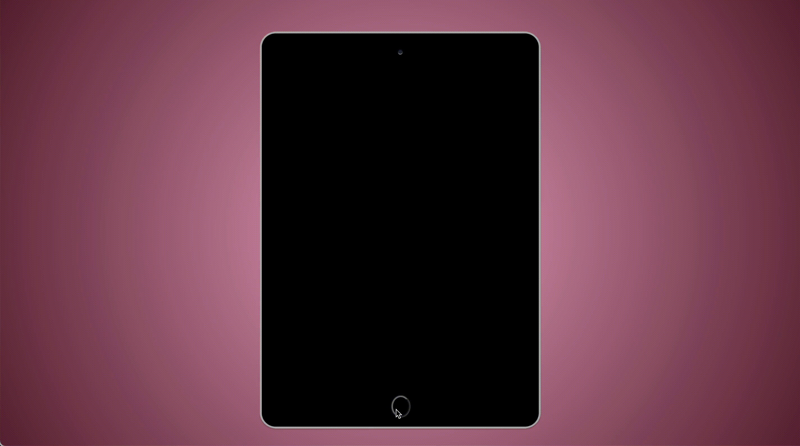

## CSS Art: iPad

### What is CSS Art? 

CSS Art is basically drawing with code.

### Languages:

This iPad is coded with 
HTML, CSS (of course), and JavaScript (to add a touch of functionality to the screen, turning on the screen on button click).

### Preview:

### Why CSS Art?

I have always enjoyed creating and love art. I have spent years drawing (check out some of my artwork [here](https://ctrlaltree.github.io/Portfolio/artwork.html)) and finally found a way to combine tech and art. 

I want to continue to develop my skillset and portfolio and figure CSS art is one way of doing that.